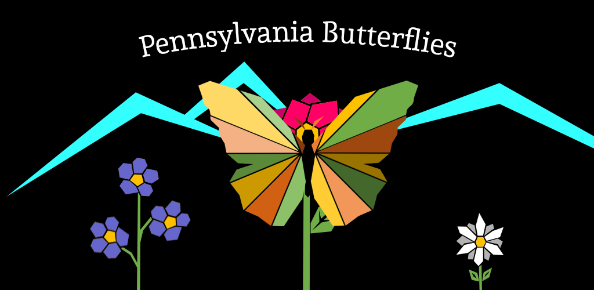
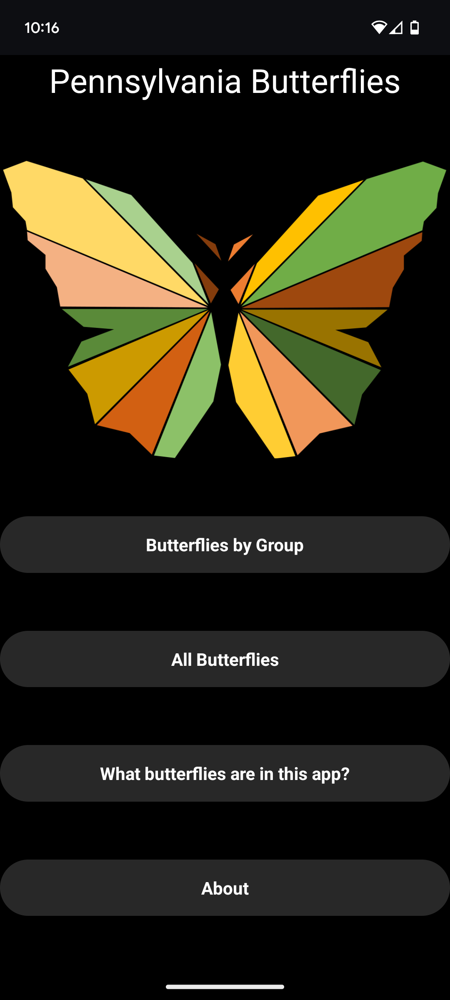
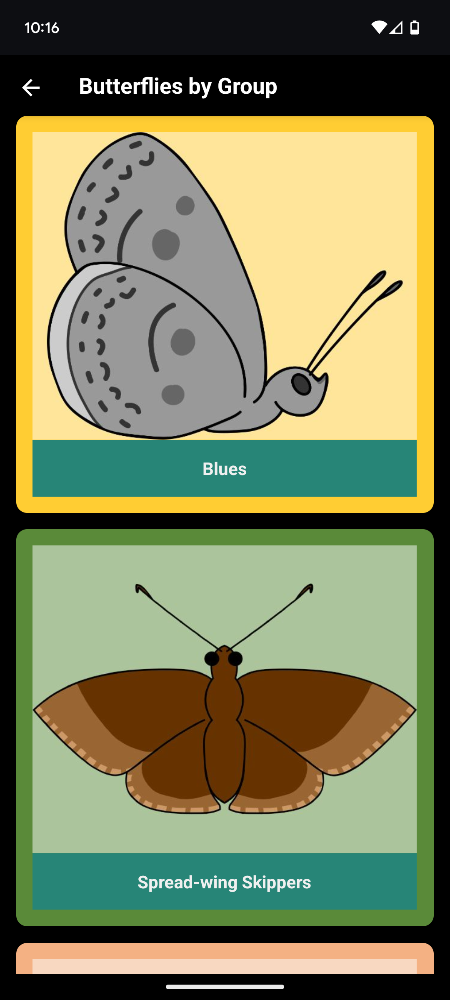
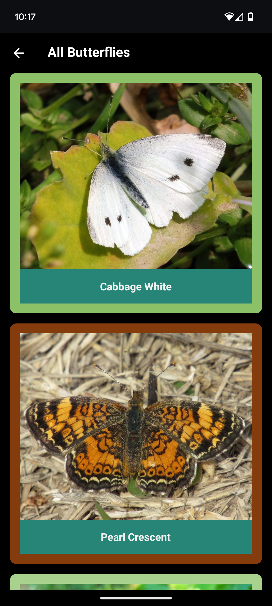
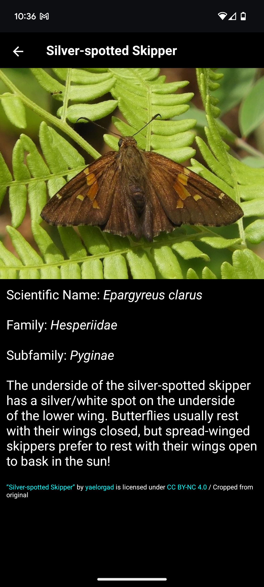
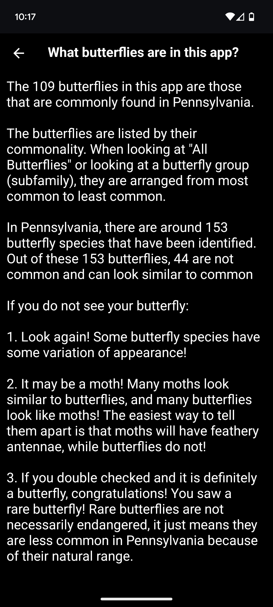
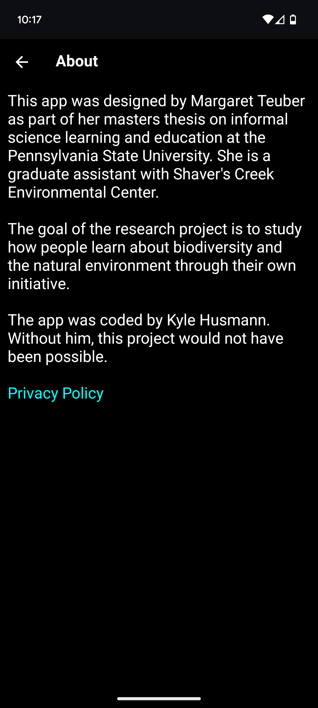

# PA Butterfly Field Guide



This project is a mobile app (Android only) that acts as a digital field guide
for 109 butterflies commonly found in Pennsylvania. To see the app in action,
check out [this video](https://www.youtube.com/shorts/v0gf1vskvGs).

## Background

This app was designed by Meg Teuber and coded by Kyle Husmann. The app was used
in a study Meg ran to understand how people learn about biodiversity and the
natural environment through their own initiative. To learn more, check out Meg's
master's thesis,
["The Use of Mobile Applications to Increase Environmental Awareness and Citizen Science Participation Among Users"](https://etda.libraries.psu.edu/catalog/17455mrt226).

## Technical Info

This app was created in React Native / Expo.

### Installation

The app is no longer available on Google Play, as the study is completed.

If you're on an Android phone, the app can still be installed manually by
following
[this link](https://github.com/khusmann/pa-butterfly-field-guide/releases/download/v2.0.0/pa-butterfly-field-guide.apk)
to download and install the APK. You may need to edit your security settings to
enable "unknown apps".

### Running from source

To run it from source, clone the repo and run:

```
npm install
npx expo start
```

Note that the expo go app only supports the latest SDK versions, so you will
need to run this in a simulator unless the expo go on your device supports SDK
v33.0.0. According to
[expo.fyi](https://github.com/expo/fyi/blob/main/outdated-sdk-versions.md):

> You can continue to use Expo Go on for old SDK versions by installing it
> through Expo CLI. Run npx expo start in your project and launch it from the
> interactive prompt — the Expo Go app will be installed with the correct
> version for your project. Note that this is not possible on iOS devices, only
> on simulators, due to restrictions around sideloading.

## Screenshots

<table>
<tr>
<td width = "33%">  </td>
<td width = "33%"></td>
<td width = "33%"></td>
</tr>
<tr>
<td width = "33%">  </td>
<td width = "33%"></td>
<td width = "33%"></td>
</tr>
</table>
